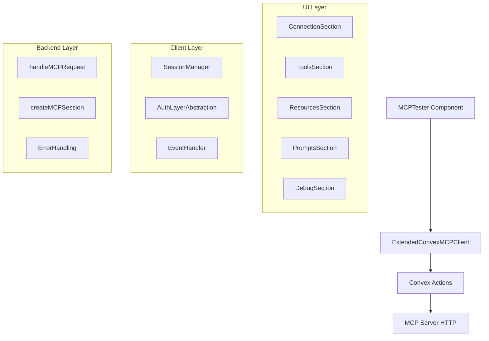
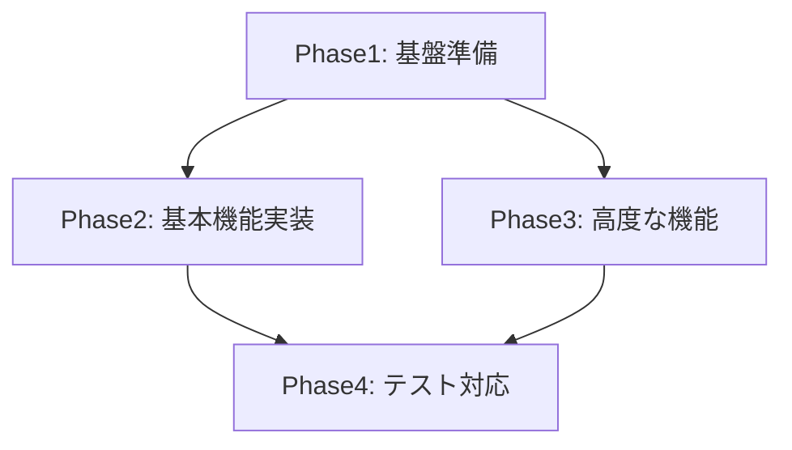

# MCPTester 設計文書

## 1. プロジェクト概要

### 1.1 目的・背景
MCPサーバーとの通信テスト・デバッグを行うWebUIコンポーネントの実装。
従来のWebSocket接続からConvex経由のHTTP通信に変更し、将来的なFirebase認証追加を容易にする設計。

### 1.2 成功基準
- Convex経由でMCPサーバーとの通信が正常に動作すること
- 段階的にテストケースに対応できること（27+個のdata-testid要素）
- Firebase認証を後から追加しやすい設計になっていること
- リアルタイムでMCP通信をテスト・デバッグできること

### 1.3 制約条件
- **技術制約**: Next.js 14 + React 18 + Ant Design 5.15.0環境
- **認証制約**: 現在はFirebase認証無効化、将来的に有効化
- **テスト制約**: 既存テストケースとの段階的互換性確保
- **期間制約**: 段階的実装によるテスト進捗確認

## 2. 要件定義

### 2.1 機能要件

#### 2.1.1 主要機能
- **MCPサーバー接続管理**: Convex経由でのセッション作成・切断
- **ツール実行**: MCPツールの一覧表示と実行
- **リソース管理**: MCPリソースの一覧表示と読み込み
- **プロンプト管理**: MCPプロンプトの一覧表示と実行
- **デバッグ機能**: リアルタイムメッセージログと整形表示

#### 2.1.2 補助機能
- **認証レイヤー**: 無効化可能な認証システム
- **エラーハンドリング**: 接続・通信エラーの適切な処理
- **ログ機能**: JSON整形表示、ログクリア、エクスポート

### 2.2 非機能要件
- **性能要件**: Convex Action経由のリアルタイム応答（<3秒）
- **可用性要件**: MCPサーバー接続状態の適切な管理
- **保守性要件**: モジュール化された設計、将来の認証追加対応

## 3. アーキテクチャ設計

### 3.1 システム構成



### 3.2 技術スタック
- **フロントエンド**: Next.js 14, React 18, TypeScript 5.4
- **UI**: Ant Design 5.15.0
- **状態管理**: React hooks + Convex real-time queries
- **通信**: Convex Actions (HTTP) → MCP Server

### 3.3 データフロー
1. **UI操作** → MCPTesterコンポーネント
2. **MCP要求** → ExtendedConvexMCPClient (認証チェックスキップ)
3. **Convex実行** → api.mcp.handleMCPRequest
4. **サーバー通信** → HTTP経由でMCPサーバー
5. **結果表示** → UI更新 + ログ記録

## 4. 詳細設計

### 4.1 コンポーネント設計

#### 4.1.1 MCPTester (メインコンポーネント)
- **責務**: 全体的なUI管理とMCPクライアント制御
- **Props**: skipAuth?, initialServerUrl?, onConnectionChange?
- **状態**: 接続状態、セッション情報、ログデータ
- **実装方針**: React hooks + Ant Design コンポーネント

#### 4.1.2 ExtendedConvexMCPClient
- **責務**: Convex経由のMCP通信、認証レイヤー抽象化
- **拡張点**: 認証スキップ機能、テスト用ユーザーID
- **インターフェース**: 既存ConvexMCPClientと互換性維持
- **実装方針**: ConvexMCPClientを継承・拡張

### 4.2 データ構造設計

```typescript
// 拡張設定
interface ExtendedConvexMCPClientConfig extends MCPClientConfig {
  skipAuthentication?: boolean;
  testUserId?: string;
}

// コンポーネントProps
interface MCPTesterProps {
  skipAuth?: boolean;
  initialServerUrl?: string;
  onConnectionChange?: (connected: boolean) => void;
}

// 状態管理
interface MCPTesterState {
  connectionState: MCPConnectionState;
  sessionId: string | null;
  tools: MCPTool[];
  resources: MCPResource[];
  prompts: MCPPrompt[];
  messageLogs: MCPMessage[];
}

// メッセージログ
interface MCPMessage {
  id: string;
  timestamp: number;
  direction: 'sent' | 'received';
  method: string;
  data: any;
}
```

### 4.3 API設計

#### 4.3.1 認証無効化対応
```typescript
class ExtendedConvexMCPClient extends ConvexMCPClient {
  private async ensureAuthentication(): Promise<void> {
    if (this.config.skipAuthentication) {
      this.userId = this.config.testUserId || 'test-user';
      return;
    }
    // 既存の認証処理
    return super.ensureAuthentication();
  }
}
```

#### 4.3.2 セクションコンポーネント
```typescript
// 接続セクション
function ConnectionSection({ 
  client, 
  onConnectionChange 
}: ConnectionSectionProps) {
  // 接続状態管理、URL入力、接続/切断ボタン
}

// ツールセクション  
function ToolsSection({ 
  client, 
  tools 
}: ToolsSectionProps) {
  // ツール一覧、パラメータ入力、実行ボタン
}
```

## 5. 実装計画

### 5.1 Phase分割

#### **Phase 1: 基盤準備 (優先度: High)**
- ExtendedConvexMCPClientの実装
- 基本的なMCPTesterコンポーネント構造
- 認証無効化機能の実装

#### **Phase 2: 基本機能実装 (優先度: High)**
- 5つの基本セクション実装
- Connection, Tools, Resources, Prompts, Debug
- 基本的なMCP通信機能

#### **Phase 3: 高度な機能 (優先度: Medium)**
- リアルタイムログ機能
- JSONフォーマッター
- エラーハンドリング強化

#### **Phase 4: テスト対応・検証 (優先度: Medium)**
- data-testid要素対応
- テストケース段階的対応
- パフォーマンス最適化

### 5.2 依存関係



### 5.3 工数見積もり

| Phase | Group | タスク数 | 工数(時間) | 並列度 |
|-------|-------|----------|------------|--------|
| 1     | 基盤  | 2        | 6          | 1      |
| 2     | UI    | 5        | 15         | 2      |
| 3     | 機能  | 3        | 9          | 2      |
| 4     | テスト| 4        | 12         | 2      |

## 6. リスク分析

### 6.1 技術リスク
- **Convex統合の複雑性**: 中程度 - 既存実装を参考に軽減可能
- **認証レイヤーの抽象化**: 中程度 - 段階的実装で対応
- **テストケース互換性**: 高程度 - 段階的対応により軽減

### 6.2 運用リスク
- **MCP Server依存性**: 中程度 - エラーハンドリングで対応
- **Convexサービス依存**: 低程度 - 既存インフラ活用

## 7. テスト戦略

### 7.1 テスト方針
- **段階的テスト**: 実装進捗に応じてテストケース対応
- **単体テスト**: コンポーネント単位のテスト
- **統合テスト**: Convex統合部分のテスト
- **E2Eテスト**: 既存テストケースとの互換性確認

### 7.2 テストケース設計指針
- data-testid要素を段階的に実装
- 既存テストケースとの互換性を重視
- 認証無効化状態でのテスト実行

### 7.3 検証項目
- [ ] MCPサーバーとの接続・切断
- [ ] ツール実行とレスポンス表示
- [ ] リソース読み込みとページネーション
- [ ] プロンプト実行と結果表示
- [ ] リアルタイムログとJSON整形
- [ ] エラーハンドリングと状態管理

## 8. 運用・保守計画

### 8.1 監視・ログ
- Convex Action実行ログ
- MCP通信エラーログ
- パフォーマンスメトリクス

### 8.2 保守性考慮
- **認証追加**: Firebase認証を後から追加しやすい設計
- **機能拡張**: 新しいMCP機能への対応
- **テスト拡張**: 新しいテストケースへの対応

### 8.3 将来の拡張計画
- Firebase認証の有効化
- リアルタイム協調機能
- MCP Server設定管理
- 高度なデバッグ機能

---

## 設計承認チェックリスト

- [ ] **要件の網羅性**: 全ての要件が文書化されている
- [ ] **技術的実現性**: Convex統合で実装可能
- [ ] **一貫性**: ConvexMCPClient拡張の設計が一貫している
- [ ] **具体性**: 実装者が迷わないレベルの詳細度
- [ ] **保守性**: 将来の認証追加に対応可能な設計

**設計文書承認**: 実装フェーズへの移行可能 