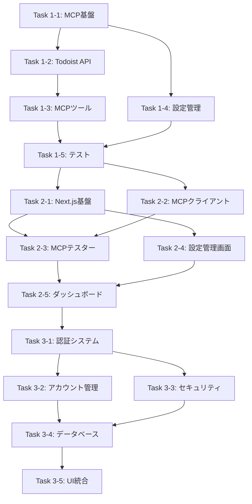

# MCP Todoist - 統合設計文書

## 1. プロジェクト概要

### 1.1 目的・背景
TodoistのAPIと同等の機能を提供するMCPサーバーを、UIとサーバーを完全分離した構成で実装する。マルチアカウント対応と将来的なスケーラビリティを考慮した個人開発プロジェクト。

### 1.2 成功基準
- **MCPサーバー**: Todoist APIの主要機能（タスク、プロジェクト管理）をMCPプロトコルで提供
- **WebUI**: 直感的なMCPサーバー管理・テスト用インターフェース
- **マルチアカウント**: 複数Todoistアカウントの安全な管理・切り替え機能

### 1.3 実装優先順位
1. **Phase 1: MCPサーバー** - MCPプロトコル対応、基本的なTodoist API連携
2. **Phase 2: WebUI** - MCPサーバー管理・テスト用インターフェース
3. **Phase 3: マルチアカウント** - 複数アカウント管理、認証システム

## 2. システムアーキテクチャ

### 2.1 全体構成

```
┌─────────────────┐    ┌─────────────────┐    ┌─────────────────┐
│   AI Tools      │    │   Web UI        │    │   CLI Tools     │
│   (Claude, etc) │    │   (Next.js)     │    │                 │
└─────────────────┘    └─────────────────┘    └─────────────────┘
         │                       │                       │
         └───────────────────────┼───────────────────────┘
                                 │
                    ┌─────────────────┐
                    │   MCP Server    │
                    │  (Standalone)   │
                    └─────────────────┘
                                 │
                    ┌─────────────────┐
                    │  Data Layer     │
                    │  (PostgreSQL)   │
                    └─────────────────┘
                                 │
                    ┌─────────────────┐
                    │  Todoist APIs   │
                    │ (Multi-Account) │
                    └─────────────────┘
```

### 2.2 プロジェクト構造

```
mcp-todoist/
├── packages/
│   ├── mcp-server/              # Phase 1: MCPサーバー（最優先）
│   │   ├── src/
│   │   │   ├── server/          # MCPプロトコル処理
│   │   │   ├── tools/           # MCPツール実装
│   │   │   ├── adapters/        # Todoist API連携
│   │   │   ├── config/          # 設定管理
│   │   │   └── types/           # 型定義
│   │   ├── package.json
│   │   └── tsconfig.json
│   │
│   ├── web-ui/                  # Phase 2: WebUI
│   │   ├── src/
│   │   │   ├── app/             # Next.js App Router
│   │   │   ├── components/      # React コンポーネント
│   │   │   └── lib/             # ユーティリティ
│   │   ├── package.json
│   │   └── next.config.js
│   │
│   ├── auth-server/             # Phase 3: 認証・マルチアカウント
│   │   ├── src/
│   │   │   ├── auth/            # 認証システム
│   │   │   ├── accounts/        # アカウント管理
│   │   │   ├── database/        # データベース層
│   │   │   └── security/        # セキュリティ
│   │   └── package.json
│   │
│   └── shared/                  # 共通型定義・ユーティリティ
│       ├── src/types/
│       ├── package.json
│       └── tsconfig.json
│
├── package.json                # ルートパッケージ（workspaces設定）
└── README.md
```

## 3. Phase 1: MCPサーバー設計（最優先）

### 3.1 技術スタック
- **Runtime**: Node.js (TypeScript)
- **Framework**: Express.js + WebSocket
- **Validation**: Zod
- **Testing**: Vitest + Supertest
- **Build**: npm workspaces

### 3.2 MCPプロトコル対応

#### 3.2.1 コア機能
```typescript
// MCPサーバーの基本インターフェース
interface MCPServer {
  // 初期化
  initialize(params: MCPInitializeParams): Promise<MCPInitializeResult>;
  
  // ツール管理
  listTools(): Promise<MCPTool[]>;
  callTool(name: string, params: any): Promise<any>;
  
  // リソース管理
  listResources(): Promise<MCPResource[]>;
  readResource(uri: string): Promise<MCPResourceContent>;
}
```

#### 3.2.2 主要MCPツール
```typescript
// タスク管理ツール
interface TaskTools {
  createTask(params: CreateTaskParams): Promise<TodoistTask>;
  updateTask(params: UpdateTaskParams): Promise<TodoistTask>;
  deleteTask(params: DeleteTaskParams): Promise<void>;
  listTasks(params: ListTasksParams): Promise<TodoistTask[]>;
  completeTask(params: CompleteTaskParams): Promise<void>;
}

// プロジェクト管理ツール
interface ProjectTools {
  createProject(params: CreateProjectParams): Promise<TodoistProject>;
  updateProject(params: UpdateProjectParams): Promise<TodoistProject>;
  deleteProject(params: DeleteProjectParams): Promise<void>;
  listProjects(): Promise<TodoistProject[]>;
}
```

### 3.3 Todoist API アダプター

#### 3.3.1 APIクライアント
```typescript
class TodoistClient {
  constructor(private apiToken: string) {}
  
  // タスク操作
  async createTask(params: CreateTaskRequest): Promise<TodoistTask>;
  async updateTask(id: string, params: UpdateTaskRequest): Promise<TodoistTask>;
  async deleteTask(id: string): Promise<void>;
  async getTasks(params?: GetTasksRequest): Promise<TodoistTask[]>;
  
  // プロジェクト操作
  async createProject(params: CreateProjectRequest): Promise<TodoistProject>;
  async updateProject(id: string, params: UpdateProjectRequest): Promise<TodoistProject>;
  async deleteProject(id: string): Promise<void>;
  async getProjects(): Promise<TodoistProject[]>;
}
```

#### 3.3.2 データ型定義
```typescript
// Todoist API型定義
interface TodoistTask {
  id: string;
  content: string;
  description: string;
  project_id: string;
  section_id?: string;
  parent_id?: string;
  order: number;
  priority: 1 | 2 | 3 | 4;
  due?: {
    date: string;
    datetime?: string;
    string: string;
    timezone?: string;
  };
  labels: string[];
  is_completed: boolean;
  created_at: string;
  updated_at: string;
}

interface TodoistProject {
  id: string;
  name: string;
  color: string;
  parent_id?: string;
  order: number;
  comment_count: number;
  is_shared: boolean;
  is_favorite: boolean;
  is_inbox_project: boolean;
  is_team_inbox: boolean;
  view_style: 'list' | 'board';
  url: string;
  created_at: string;
  updated_at: string;
}
```

### 3.4 設定管理

#### 3.4.1 設定ファイル構造
```typescript
interface MCPServerConfig {
  server: {
    port: number;
    host: string;
    protocol: 'http' | 'websocket';
  };
  todoist: {
    apiToken: string;
    baseUrl: string;
    timeout: number;
    retryCount: number;
  };
  logging: {
    level: 'debug' | 'info' | 'warn' | 'error';
    format: 'json' | 'text';
  };
}
```

#### 3.4.2 環境変数
```bash
# .env.example
MCP_SERVER_PORT=3001
MCP_SERVER_HOST=localhost
TODOIST_API_TOKEN=your_api_token_here
TODOIST_BASE_URL=https://api.todoist.com/rest/v2
LOG_LEVEL=info
```

## 4. Phase 2: WebUI設計

### 4.1 技術スタック
- **Framework**: Next.js 14 (App Router)
- **UI Library**: Ant Design
- **State Management**: React状態（必要に応じてConvex）
- **Testing**: Vitest + React Testing Library
- **E2E Testing**: Playwright（Phase 2後半、できれば）

### 4.2 ページ構成

#### 4.2.1 基本ページ
```typescript
// ページ構成
interface WebUIPages {
  '/': HomePage;                    // ダッシュボード
  '/test': MCPTesterPage;          // MCPサーバーテスト
  '/settings': SettingsPage;       // 設定管理
  '/api/mcp': MCPProxyAPI;         // MCP API プロキシ
}
```

#### 4.2.2 主要コンポーネント
```typescript
// MCPテスターコンポーネント
interface MCPTesterProps {
  serverUrl: string;
  onResponse: (response: MCPResponse) => void;
}

// 設定管理コンポーネント
interface SettingsProps {
  config: MCPServerConfig;
  onSave: (config: MCPServerConfig) => void;
}
```

### 4.3 MCPクライアント

#### 4.3.1 WebSocket接続
```typescript
class MCPWebSocketClient {
  private ws: WebSocket | null = null;
  
  connect(url: string): Promise<void>;
  disconnect(): void;
  
  send(request: MCPRequest): Promise<MCPResponse>;
  
  // ツール操作
  async callTool(name: string, params: any): Promise<any>;
  async listTools(): Promise<MCPTool[]>;
}
```

## 5. Phase 3: マルチアカウント設計

### 5.1 認証システム（Firebase Auth）

#### 5.1.1 Firebase Auth統合
```typescript
// Firebase Auth利用で認証を簡素化
interface FirebaseUser {
  uid: string;
  email: string;
  displayName: string;
  photoURL?: string;
}

interface UserProfile {
  uid: string;              // Firebase UID
  email: string;
  name: string;
  activeAccountId?: string;
  createdAt: Date;
  updatedAt: Date;
}
```

#### 5.1.2 アカウント管理（Convex Database）
```typescript
// Convex データベーススキーマ
interface TodoistAccount {
  _id: string;
  uid: string;             // Firebase UID
  name: string;
  apiToken: string;        // 暗号化保存
  settings: AccountSettings;
  isActive: boolean;
  _creationTime: number;   // Convex標準
}

interface AccountSettings {
  timezone: string;
  language: string;
  syncEnabled: boolean;
  notifications: {
    email: boolean;
    push: boolean;
  };
}
```

### 5.2 セキュリティ設計

#### 5.2.1 データ分離
```typescript
// 操作コンテキスト
interface OperationContext {
  userId: string;
  accountId: string;
  permissions: Permission[];
}

// アクセス制御
class AccessControl {
  validateAccess(context: OperationContext, resource: string): Promise<boolean>;
  checkPermission(context: OperationContext, permission: Permission): Promise<boolean>;
}
```

#### 5.2.2 API トークン管理
```typescript
class TokenManager {
  encrypt(token: string): string;
  decrypt(encryptedToken: string): string;
  rotateToken(accountId: string, newToken: string): Promise<void>;
  validateToken(accountId: string): Promise<boolean>;
}
```

## 6. 実装計画

### 6.1 Phase分割

#### Phase 1: MCPサーバー（最優先）
- **Task 1-1**: MCPプロトコル基盤実装
- **Task 1-2**: Todoist APIクライアント実装
- **Task 1-3**: 基本MCPツール実装（タスク、プロジェクト）
- **Task 1-4**: 設定管理・ログ機能
- **Task 1-5**: テスト実装

#### Phase 2: WebUI
- **Task 2-1**: Next.js基盤セットアップ
- **Task 2-2**: MCPクライアント実装
- **Task 2-3**: MCPテスター画面実装
- **Task 2-4**: 設定管理画面実装
- **Task 2-5**: ダッシュボード実装

#### Phase 3: マルチアカウント
- **Task 3-1**: 認証システム実装
- **Task 3-2**: アカウント管理実装
- **Task 3-3**: セキュリティ機能実装
- **Task 3-4**: データベース設計・実装
- **Task 3-5**: UI統合・テスト

### 6.2 依存関係



### 6.3 工数見積もり（個人開発、TDD開発）

| Phase | Task数 | 想定工数 | テスト工数 | 並列度 | 期間 |
|-------|--------|----------|------------|--------|------|
| Phase 1 | 5 | 30時間 | 15時間 | 1 | 1-2週間 |
| Phase 2 | 5 | 20時間 | 10時間 | 1 | 1週間 |
| Phase 3 | 5 | 25時間 | 10時間 | 1 | 1週間 |
| **合計** | **15** | **75時間** | **35時間** | **1** | **3-4週間** |

**注**: Firebase/Convex採用により従来比40%工数削減

## 7. 技術的考慮事項

### 7.1 テスト戦略（TDD開発）
- **単体テスト**: Vitest（優先度：高）
  - 個別関数・クラスのテスト
  - Todoist APIクライアントのテスト
  - MCP ツール関数のテスト
- **結合テスト**: SuperTest（優先度：中）
  - MCPサーバーのHTTP/WebSocketエンドポイント
  - Todoist API連携テスト
  - MCPプロトコル準拠テスト
- **E2Eテスト**: Playwright（優先度：低、できれば）
  - WebUI全体フローテスト

### 7.2 パフォーマンス
- MCPサーバーのステートレス設計
- Todoist API呼び出しの最適化
- WebSocketコネクション管理

### 7.3 エラーハンドリング
- MCPプロトコルエラー処理
- Todoist APIエラー処理
- ネットワークエラー対応

### 7.4 ログ・監視
- 構造化ログ出力
- パフォーマンス監視
- エラー追跡

## 8. 次ステップ

### 8.1 即座に開始可能なタスク
1. **Task 1-1**: MCPプロトコル基盤実装
2. **Task 1-2**: Todoist APIクライアント実装

### 8.2 準備が必要なタスク
1. 開発環境セットアップ
2. Todoist API トークン取得
3. テスト環境構築

---

この統合設計文書に基づいて、Phase 1のMCPサーバー実装から開始する準備が整いました。次に、Task 1-1のMCPプロトコル基盤実装の詳細設計に進みますか？ 